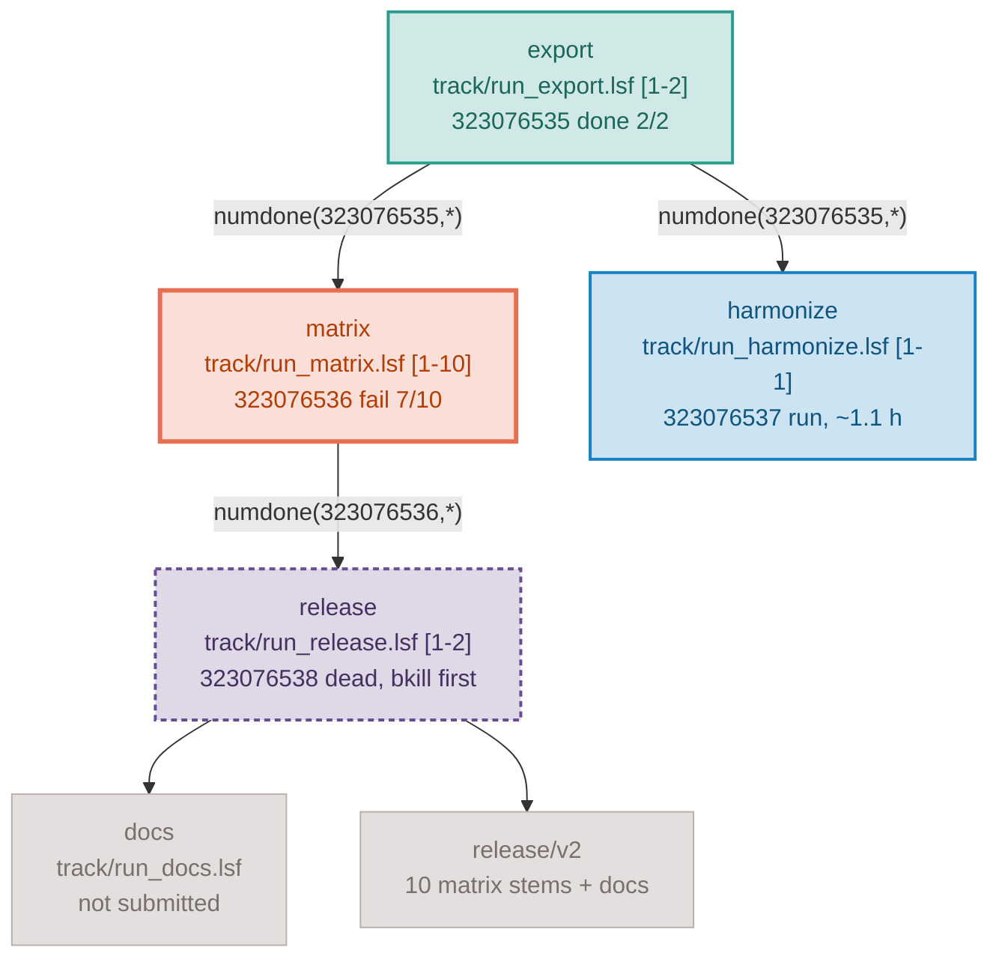

# Reference: plan, progress, and decision files

Three documents govern any piece of pipeline work: a _plan_ (the intent), a
_progress_ file (the state), and a _decision_ file (the choices made and what
they beat). All three must be kept current — an out-of-date plan, progress, or
decision file is worse than none.

They exist at two tiers. Tier 1 describes the stage; tier 2 describes one
specific question inside it.

This file fixes **which sections each document has**. How a section is rendered
-- Mermaid for dependencies, a table for repeated attributes, a checklist for
actionable work, a code block for anything copyable, prose for interpretation --
is owned by `markdown-doc`, along with the resume-first ordering and the
measured-vs-projected rule.

```
src/NN-stage-name/
  PLAN.md                             tier 1 — stage charter
  PROGRESS.md                         tier 1 — stage dashboard + campaign index
  DECISION.md                         tier 1 — cross-cutting decisions
  2026-08-20-exact-match-only.PLAN.md      tier 2 — one question, design + Q&A
  2026-08-20-exact-match-only.PROGRESS.md  tier 2 — that question's run state
  2026-08-20-exact-match-only.DECISION.md  tier 2 — that question's decisions
```

Tier-2 naming: `{YYYY-MM-DD}-{short-title}.PLAN.md`,
`{YYYY-MM-DD}-{short-title}.PROGRESS.md`, and
`{YYYY-MM-DD}-{short-title}.DECISION.md`, all sharing one stem. The date is the
day the plan is written. `{short-title}` is lowercase kebab-case, 2-5 words,
naming the question rather than the stage. The uppercase `.PLAN.md` /
`.PROGRESS.md` / `.DECISION.md` suffix is what distinguishes a live tier-2 file
from a historical lowercase `{date}-{short-name}.progress.md`.

When to create which tier is in `SKILL.md` section 1.1.

---

## A. Tier-1 `PLAN.md` — stage charter

Durable. Describes what the stage is for and what holds across every campaign
in it. Written before the stage's first implementation, approved by the user,
then kept in sync with the scripts.

```markdown
# Stage NN — <title>

## Goal

One paragraph: what question this stage answers and what it produces.

## Data inventory

| Input | Path | Rows / size | Notes |
Verified headers and key formats, not assumed ones.

## Steps

### 01-step-name

- Script: `01-step-name.R`
- Inputs: exact paths
- Outputs: exact paths
- Method: 2-4 sentences

(repeat per step)

## Cross-cutting decisions

Decisions that every campaign in this stage inherits (cohort definition,
covariate set, significance threshold, output roots).

## Open questions

Q1. <contested design decision>
Recommended: <the option you would take and why>
Q2. ...

## Figure

[DIAGRAM.md](DIAGRAM.md)

## Decisions

[DECISION.md](DECISION.md)
```

## B. Tier-2 `{date}-{short-title}.PLAN.md` — one question

Scoped to a single question. Never restates the whole stage; it links to
`PLAN.md` and records only the delta.

```markdown
# <short title>

Stage: `src/NN-stage-name/`
Stage charter: [PLAN.md](PLAN.md)
Status: DRAFT | APPROVED YYYY-MM-DD | SUPERSEDED by <file>

## Question

One paragraph: what is being asked and why the existing outputs do not answer it.

## Scope

Which scripts/steps this touches, and which existing outputs it invalidates
(name them; write "none" if none).

## Design

What changes, step by step, with exact input and output paths.

## Open questions

Q1. ... Recommended: ...

## Progress

[{date}-{short-title}.PROGRESS.md]({date}-{short-title}.PROGRESS.md)

## Decisions

[{date}-{short-title}.DECISION.md]({date}-{short-title}.DECISION.md)
```

Rules for both tiers:

- The plan must be detailed enough that a fresh agent session can execute it
  without re-reading every script.
- Embed ambiguous decisions as `Q1`, `Q2`, ... with a **recommended answer**
  for each, so the user can approve or redirect quickly. Do not answer them in
  chat instead of in the plan, and do not silently pick one.
- Update the plan in the same change set whenever a script contradicts it.
- When a tier-2 plan changes a cross-cutting decision, edit `PLAN.md` too;
  the tier-1 file must never lag behind the code.

## C. Figure brief

The stage's figure lives in its own file, `DIAGRAM.md`, next to `PLAN.md`. A
figure scoped to one question lives in `{date}-{short-title}.DIAGRAM.md`,
sharing the stem of its `.PLAN.md` / `.PROGRESS.md` / `.DECISION.md` set. The
plan carries only a one-line link under `## Figure`; never inline the prompt.

A tier-2 plan needs its own brief only if it changes the stage's data flow or
introduces a method a reader cannot infer from the stage figure.

Brief structure, the five archetypes, the Nature Reviews Genetics style
contract, palette binding, and the ASCII-only formula rules are owned by the
`image-prompt` skill.

## D. Tier-2 `{date}-{short-title}.PROGRESS.md` — run state

Created **before** the first run of that question. This is where job IDs,
counts, and errors live.

```markdown
# <short title> — progress

Stage: `src/NN-stage-name/`
Plan: [{date}-{short-title}.PLAN.md]({date}-{short-title}.PLAN.md) (APPROVED YYYY-MM-DD)
Decisions: [{date}-{short-title}.DECISION.md]({date}-{short-title}.DECISION.md)

## Resume block

Copy-paste prompt for a new session: what is done, what is pending,
which commands check status, what to run next. Point at the decision file
for what is already settled and which entries are still provisional.

### Pipeline graph

<the Mermaid state graph, section D.1. Required once any step has been
submitted; omit it only for a stage with a single step.>

## Todo list

- [x] 01-step-name — done YYYY-MM-DD, 698 rows out
- [ ] 02-step-name — submitted, job 12345678[1-22]
- [ ] 03-step-name — waiting on 02

## Job table

| Job ID | Name | Array | Depends on | DONE | RUN | PEND | Est. time |
| 12345678 | la-rfmix | 1-22 | - | 4 | 18 | 0 | ~30-40 min/task |
| 12345679 | la-collate | 1-1 | `numdone(12345678,*)` | 0 | 0 | 1 | ~10 min |

State file (when the chain was submitted in one call):
`logs/lsf-pipeline/<name>-<stamp>.tsv`

## Output file counts

| Step | Expected | Actual | Command |
| 02 | 22 | 4 | `ls data/intermediate/NN-stage/*.tsv \| wc -l` |

## Error log

- YYYY-MM-DD 02-step: `--covar-name` mismatch (`FID_IID` vs `IID`).
  Fix: rebuilt covar with FID column. Re-submitted as 12345679.

## Key paths

- Intermediates: `data/intermediate/NN-stage/`
- Results: `results/NN-stage/`
- Logs: `logs/NN-stage/`
```

### D.1 The pipeline graph

A running pipeline has a **shape** and a **state**, and a table shows neither at
a glance. The graph shows both: it is the DAG that was actually submitted, with
one of six classes per stage. It goes in the Resume block, above the todo list,
because it is the first thing a resuming session — or the user at 7 a.m. —
reads.

| Class  | State                                                    | What it asks for                         |
| ------ | -------------------------------------------------------- | ---------------------------------------- |
| `done` | finished **and outputs verified**                        | nothing                                  |
| `run`  | RUN now                                                  | wait; the label carries the estimate     |
| `pend` | submitted, waiting for a slot or for its dependency      | wait                                     |
| `todo` | not submitted yet                                        | submit it, or chain it behind its parent |
| `fail` | EXIT, or DONE with missing or short outputs              | read the first `.err` files, fix, rerun  |
| `dead` | submitted, PEND behind a condition that can never be met | `bkill`, then resume from the break      |

`done` means verified, not DONE. A DONE array with missing outputs is `fail` —
the masked-failure rule in `long-running-jobs` section 6.

`dead` only exists once a whole chain is submitted in one call, and it is the
state that costs a night when it is not visible: a failed stage leaves every
downstream job PEND on a condition the scheduler will never satisfy, so the
queue looks busy while nothing can ever run. -> `long-running-jobs` section 7.

Node label: the stage id, then **the path of the script that runs it**, then the
state with a count or an estimate, separated by `<br/>`. Put the dependency
expression on the edge when it is not obvious. Graph the stages, not the files;
a terminal artifact node is fine when it is what the campaign delivers.

The script path is not decoration. Where the repository has the LSF DAG
submitter, **this block is the submission input** — it reads the node ids, the
script paths, and the edges, and submits the chain from them. That is why there
is no separate spec file to keep in sync: the graph the user reads is the graph
that ran, because it would not have submitted otherwise. Consequences for how
the block is written:

- Node id = stage id, `[A-Za-z0-9_]` only.
- A node whose label carries no `.lsf` / `.sbatch` path is display-only — an
  artifact box — and is skipped at submission along with its edges.
- `ext_<jobid>` names a job already in the queue.
- `:::class` is display state. The submitter never reads it, so a stale class
  cannot cause a wrong submission; it only misleads a human.
- The array spec in the label is display too. Array-ness is re-read from the
  script's `#BSUB -J` at submit time, so a stale `[1-10]` cannot swap `numdone`
  for `done`.



Copy the `classDef` block **verbatim**. It is fixed documentation chrome, not a
figure palette: it does not belong in a track `color.R`, and it is not
re-derived per campaign. Six classes, no more — a seventh state nobody acts on
differently is noise. These six are the state half of the shared documentation
palette; the structural half, the `TD` direction rule, and the rest of the
diagram library live in `markdown-doc`
[references/mermaid-patterns.md](../../markdown-doc/references/mermaid-patterns.md).

**Write the graph with the plan, before the first submission**, every node
`todo` and no job IDs. That is when the DAG is decided and approved, and it
makes the approved plan and the submission input the same artifact.

**Update it in the same edit as the todo list and the job table**, never
batched. This is a paste, not a drawing exercise: the submitter prints the block
at submission, and `--status <state.tsv>` reprints it with live classes.

## E. Tier-1 `PROGRESS.md` — stage dashboard

One screen. Says where the stage stands and points at the campaign that owns
the detail. It never duplicates a tier-2 job table.

```markdown
# Stage NN — <title> progress

Decisions: [DECISION.md](DECISION.md)

## Current state

Two or three sentences: what is complete, what is running, what is blocked.

### Pipeline graph

<the Mermaid state graph, section D.1, at stage granularity: one node per
campaign or per step chain, not per array task.>

## Campaigns

| Plan | Progress | Decisions | Started | Status |
| [2026-08-20-exact-match-only.PLAN.md](...) | [.PROGRESS.md](...) | [.DECISION.md](...) | 2026-08-20 | DONE |
| [2026-08-25-gnomad-rerun.PLAN.md](...) | [.PROGRESS.md](...) | [.DECISION.md](...) | 2026-08-25 | RUNNING |

## Historical records (read only)

- `plan.md`, `2026-06-30-<name>.progress.md` — pre-convention, do not edit.

## Key paths

- Intermediates: `data/intermediate/NN-stage/`
- Results: `results/NN-stage/`
- Logs: `logs/NN-stage/`
```

When a stage has no tier-2 campaigns yet, `PROGRESS.md` carries the full
template from section D instead of the index table.

**Mandatory update rule** — update the matching section immediately, never
batch, after each of: step completion, job submission, error diagnosis,
script/config modification, re-submission, and session end. A campaign that
starts or finishes also updates its row in the tier-1 index in the same edit.

Organize by section so a reader can scan, not by chronology.

## F. `DECISION.md` — decision log

The plan says what will be done and the progress file says what has happened.
Neither records which alternatives were weighed at each fork and why one won.
That is the part of the agent's work a later session most needs and cannot
recover: without it, the next session re-opens settled choices or proposes an
alternative that was already rejected. The decision file holds exactly that,
and nothing else.

It is a **log of decisions, not of reasoning**. The test for an entry: it can
be written as "chose X over Y because Z". Narrative, hypotheses considered,
tool calls, and intermediate reasoning do not pass that test and do not go in.
A fix with only one sensible form is not a decision either; it belongs in the
progress file's Error log.

### What goes where

| Content                                               | File                                                |
| ----------------------------------------------------- | --------------------------------------------------- |
| What will be built, exact paths, method               | `PLAN.md` Design / Steps                            |
| A design question the user must answer                | `PLAN.md` Q&A                                       |
| A task, job ID, output count, error and its fix       | `PROGRESS.md`                                       |
| A choice made between alternatives, and what it beat  | `DECISION.md`                                       |
| A `Q` outcome once the user approves or overrides it  | `DECISION.md`                                       |
| A choice taken without the user, pending confirmation | `DECISION.md`, `Status: provisional`                |
| A reversal of an earlier choice                       | `DECISION.md`, new entry; old one marked superseded |

### Tier-2 `{date}-{short-title}.DECISION.md`

```markdown
# <short title> — decisions

Stage: `src/NN-stage-name/`
Plan: [{date}-{short-title}.PLAN.md]({date}-{short-title}.PLAN.md)
Progress: [{date}-{short-title}.PROGRESS.md]({date}-{short-title}.PROGRESS.md)

One entry per decision, numbered in the order made, newest last.

## D1 — <the choice, one line> (YYYY-MM-DD)

- Instead of: <the alternative(s) rejected>
- Why: <the one reason that decided it>
- Evidence: <path, command and result, row count, or "Q2 approved by user">
- Status: active

## D2 — <the choice, one line> (YYYY-MM-DD)

- Instead of: ...
- Why: ...
- Evidence: ...
- Status: provisional — taken without user confirmation; confirm or reverse

## D3 — <the choice, one line> (YYYY-MM-DD)

- Instead of: ...
- Why: ...
- Evidence: ...
- Status: superseded by D5 (YYYY-MM-DD)
```

Four fields, always in that order. `Status` is `active`, `provisional`, or
`superseded by Dn (date)`. `D` numbers mirror the plan's `Q` numbers in spirit:
a `Q` that the user approves or overrides becomes a `D` entry whose Evidence
line is the approval, and whose Why line is the user's reason when they
overrode the recommendation.

### Tier-1 `DECISION.md`

Same shape, restricted to decisions that hold across every campaign in the
stage: cohort definition, covariate set, threshold, reference panel, output
roots, tool choice. When a tier-2 decision turns out to hold for the whole
stage, copy it here in the same edit — the same rule that makes a tier-2 plan
edit `PLAN.md` when it changes a cross-cutting decision. A stage with no tier-2
campaigns yet carries all its decisions here, exactly as `PROGRESS.md` carries
the full run state.

### Rules

- **Created with the plan, not after the first run.** The alternatives rejected
  while writing the plan are its first entries; the plan's Design assumes them.
  The file may hold two or three entries at that point; it grows.
- **One reason per entry.** The reason that actually decided it, not a list of
  pros and cons. If two reasons were needed, the second is usually evidence.
- **Evidence is concrete.** A path, a command and its result, a row count, a
  job ID, or the user's approval. "Seemed better" is not evidence.
- **Append-only, dated, numbered.** Never edit an entry's substance. A reversal
  is a new entry; the old one gets `Status: superseded by Dn (date)`. A
  `provisional` entry becomes `active` when the user confirms it, or is
  superseded when they do not.
- **Update immediately, never batch**, the moment any of these happens: a
  choice is made between alternatives during planning, implementation, or
  debugging; the user approves or overrides a `Q`; a choice is taken without
  the user; an earlier choice is reversed. When the progress file changes for
  the same reason, update both in one edit.
- **A stage or campaign that predates this convention has no decision file.**
  Create one at the tier being touched the next time work happens there, and
  start at `D1` with the first decision made that day. Do not reconstruct
  earlier decisions from chat that no longer exists.
- **Reading order on resume:** `PROGRESS.md` for where things stand,
  `DECISION.md` for what is settled and what is still provisional, then
  `PLAN.md` for the design as needed.

## G. Multi-session check-fix-submit cycle

Each time the user asks to "check progress" or "go ahead":

1. **Read the decision file first** — it says what is already settled, so the
   session does not re-open a choice or propose an alternative that was
   rejected. `provisional` entries are the ones to confirm with the user.
2. **Check jobs** — `bjobs -A | grep <prefix>` or `squeue -u $USER`.
3. **Count outputs** — `ls <output_pattern> | wc -l` per step vs expected.
4. **Read errors** — if jobs are DONE but outputs are missing, read
   `logs/<stage>/<script>_<jobid>_<idx>.err` for the first few failures.
5. **Diagnose** the actual message. Recurring root causes:
   - Column-name or sample-ID mismatch (the most common by far) — verify both
     sides of every merge before hard-coding.
   - Multicollinearity when ancestry covariates sit alongside PCs — relax the
     tool's VIF check if the collinearity is intentional.
   - File-extension mismatch between what a tool writes and what the next step
     globs — confirm real filenames with `ls`.
   - Masked failure: the wrapper swallowed a non-zero exit code, so DONE is a
     lie. Always check outputs, not job status.
6. **Fix** with the minimal change; no unrelated refactoring. When the fix
   could take more than one form, the form chosen and what it beat is a `D`
   entry in the decision file; a fix with one obvious form is not.
7. **Re-submit** only the failed step.
8. **Update the progress file** with the error, the fix, new job IDs, and new
   counts — the tier-2 file for the active campaign, or `PROGRESS.md` when the
   stage has no tier-2 campaigns — and the decision file with any `D` entry
   from step 6, in the same edit. Re-class the pipeline graph in that same edit.

### G.1 When the whole chain was submitted at once

A chained pipeline changes steps 2 and 7. The rest of the cycle is unchanged.

**Step 2 becomes: check the graph, not the queue.** After a mid-chain failure
every downstream job is PEND, which looks healthy in `bjobs`. One pass over the
state file classifies every stage and marks the ones stranded behind the break:

```bash
submit_lsf_pipeline.sh --status logs/lsf-pipeline/<name>-<stamp>.tsv
```

**Step 7 becomes: resume from the break, never from the first stage.** In order:

1. `bkill` the `dead` jobs. They can never run, and they still carry the old
   dependency on the job that failed. The status output prints the exact line.
   Killing queued work is irreversible, so propose the command and let the user
   approve it — never run it silently.
2. Rerun **only the failed indices**: `bsub -J "<name>[3,7]" < <step>.lsf`. A
   command-line `-J` overrides the one in the file.
3. Requeue the tail behind that rerun:
   `submit_lsf_pipeline.sh --graph <PROGRESS.md> --after <new-jobid> --from <next-stage>`.
4. Paste the new graph and the new job IDs into the progress file.

Depending on the rerun array alone is correct: the elements that already
finished are DONE and verified, and the rerun covers exactly the ones that were
not. Re-running a verified stage to "be safe" costs hours and, where a step is
not idempotent, can destroy a good output. -> `long-running-jobs` section 7.

## H. Deciding what to re-run

After a mid-pipeline fix, assess each downstream step independently:

- Does not consume the changed file → do NOT re-run.
- Consumes it, and its outputs are newer than the change → do NOT re-run.
- Consumes it, and its outputs are missing or older than the change → re-run
  only that step. Compare with `stat -c '%Y %n' <changed-file> <output>`.

The same test picks the resume point of a chain: `--from` names the earliest
stage that must re-run, and everything upstream of it stays as it is.

## I. Time estimates

Add a rough range to the Job Table (e.g. "~30-40 min/task", "~2-3 h total"),
based on sample and variant counts, prior runs of a similar step
(`bjobs -l <jobid>` elapsed time), and the wall-time header as an upper bound.
A range is enough; it tells the user whether to wait or come back later.

## J. Cross-session handoff

When a session ends with jobs pending, the active progress file must contain
the exact pending job IDs, the quick-check commands, and the exact next
commands to run, and the matching decision file must hold every choice the
pending work rests on, with any taken without the user marked `provisional`.
The next session resumes from those two files alone, reached in one hop from
the `PROGRESS.md` campaign index.

When the work was submitted as one dependency chain, the handoff also carries
the pipeline graph with its current classes and the path of the state file the
submitter wrote. Without the state file, the next session cannot tell a job that
is merely waiting from one that is stranded behind a failure.
