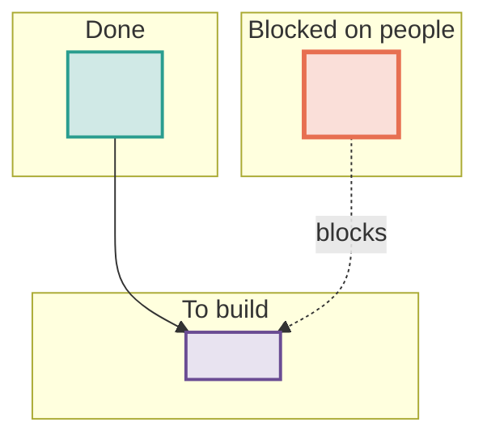

# Reference: the brainstorm skeleton

Copy this, keep the section order, delete nothing. A section with no content
keeps its heading and gets the word `none` under it, so a reader can tell
"checked, empty" from "nobody looked".

Replace every `<...>` placeholder. Replace every number with one read from a
file, and name the file.

---

## A. The skeleton

````markdown
# <question in five words> — brainstorm

**Date:** YYYY-MM-DD | **Status:** OPEN | **Updated:** YYYY-MM-DD | **Author:** <name>

## What this file is and is not

This is a thinking document, not a plan. It triggers no Plan-First Gate,
creates no `PROGRESS.md`, and authorizes no implementation.

Its job is to answer one question: **<the question, in one sentence>.**

The charter is [<path>](path). This file does not replace it; it turns
<which part> into an ordered work queue and names what was left open.

---

## 0. TL;DR

<Two or three sentences. What blocks everything, and the one thing that can
start now.>

| #   | Blocker           | Who resolves it |
| --- | ----------------- | --------------- |
| B1  | <what is missing> | <person>        |

<One sentence naming the unblocked item on the critical path, and why it goes
first.>

---

## 1. Where we are, verified YYYY-MM-DD

### 1.1 Done

| Asset  | Value              | Source   |
| ------ | ------------------ | -------- |
| <name> | <number, measured> | `<path>` |

### 1.2 Exists but empty, or exists but unused

| Thing  | State   |
| ------ | ------- |
| <path> | <state> |

### 1.3 Not delivered / not started

| Thing  | State                              |
| ------ | ---------------------------------- |
| <name> | <state, and what it is waiting on> |

---

## 2. The whole picture

<One sentence saying what the reader should take away.>



---

## 3. Blockers, in detail

### B1 — <one line>

<What it blocks, and why it is mandatory rather than nice to have, with the
source that says so.>

What we can do meanwhile:

- <unblocked work>

Worth asking <person> for: <the exact questions, so one message settles it>.

---

## 4. Questions to settle before <the first thing to be written>

Each has a recommendation. These are the forks that change the analysis
meaning, so none should be decided silently inside an implementation.

### Q1 — <question> [OPEN]

<One sentence of context. Then why it changes the analysis meaning.>

| Option       | Cost          |
| ------------ | ------------- |
| (a) <option> | <consequence> |
| (b) <option> | <consequence> |

**Recommended: (a).** <Why.>

**Evidence:** `<path>`, read YYYY-MM-DD.

---

## 5. What each stage should do

| Stage    | Question it answers | Key output | Blocked by |
| -------- | ------------------- | ---------- | ---------- |
| `<name>` | <question>          | `<path>`   | <B or Q>   |

### `<the hard one>` is the long pole — plan it first

Measured facts: <numbers, each with a source>.

What this stage has to get right:

1. <trap, and what it costs when it is missed>

The one number nobody has yet: <the number>. Everything about runtime and the
multiple-testing burden follows from it, so produce it first.

---

## 6. Technical detail

### 6.1 <tool or method> — what it does and does not do

Installed version: <from the binary, not the docs>, checked YYYY-MM-DD.

What it does **not** do, so the plan must route around it:

- <missing mode>, and the substitute.

### 6.2 Parameters

| Parameter | Proposed | Why this value | What changes if it moves | Source                 |
| --------- | -------- | -------------- | ------------------------ | ---------------------- |
| <name>    | <value>  | <reason>       | <consequence>            | <path or tool version> |

---

## 7. Scale reality check

Rough, and explicitly labelled rough — the real numbers come from <stage>.

| Quantity | Estimate                                          |
| -------- | ------------------------------------------------- |
| <name>   | <value>, measured                                 |
| <name>   | <value>, **unknown** — <what has to happen first> |

**The first useful number to produce is <the number>.** <Why every later
decision depends on it.>

---

## 8. Traps already paid for, do not re-buy

1. <trap> — <the symptom, which is usually silence rather than an error>.

---

## 9. Proposed order of work

Ordered by what unblocks the most, not by stage number.

**Now, in parallel, nothing blocks these:**

1. <task>

**Then, once <condition>:**

2. <task>

---

## 10. What I need from you

| #   | Decision   | Default if you say nothing |
| --- | ---------- | -------------------------- |
| 1   | <decision> | <what happens instead>     |

<Which questions do not block the start of work and can wait for a stage plan.>

---

## 11. Discussion log

| Round | Date       | What changed                            |
| ----- | ---------- | --------------------------------------- |
| 1     | YYYY-MM-DD | Opened. Q1-Qn posed, <n> blockers named |
````

---

## B. Writing order

The section order above is the reading order, not the writing order. Write in
this order instead:

1. **Section 1, the verified state.** Nothing else can be written honestly
   until this exists. Gather it with read-only checks -> `data-verification`.
   Every row gets a source and a read date as it is written, never afterwards.
2. **Section 2, the picture**, straight from section 1. Drawing it is what
   exposes the missing dependencies.
3. **Section 3, the blockers.** These fall out of section 2 as the nodes with
   no incoming edge and no owner in the repository.
4. **Section 5, the stage table**, which is section 2 as a list.
5. **Section 4, the questions.** Every place the stage table had to guess is a
   `Q`.
6. **Sections 6 and 7**, the detail behind whichever questions need it.
7. **Section 8**, swept from every `AGENTS.md`, `DECISION.md`, and failed run
   in scope.
8. **Section 9**, a topological sort of section 2 weighted by what unblocks the
   most.
9. **Section 10**, the subset of section 4 that the user has to answer now.
10. **Section 0, the TL;DR**, written last from sections 3 and 9.
11. **Section 11**, one row, before handing the file over.

---

## C. Later rounds

A round is a discussion pass, not an edit. Each one:

- appends a row to `## Discussion log`;
- updates `**Updated:**` in the header;
- changes a `Q` status tag, or appends a `**Resolution:**`, or adds an option
  row -- never overwrites a recommendation;
- re-reads any number older than the last round before relying on it again.

When a round produces new evidence -- a tool's real `--help`, a count that was
finally computed, a collaborator's answer -- that evidence goes into section 1
or 6 with its date, and the `Q` it affects gains a line saying which fact moved
it. A recommendation that reverses says so in the resolution, with the reason.

Set `Status: SETTLED YYYY-MM-DD -> <plan file>` only when every `Q` carries
`RESOLVED`, `DEFERRED`, or `DROPPED`.

---

## D. Length

There is no line budget; there is a relevance budget. A brainstorm earns its
length by being the only place a fact is written down.

Cut anything that:

- restates a number already in the source file, without adding the comparison
  that makes it meaningful;
- narrates what was searched or which tool call was made;
- explains a concept the reader already applies daily;
- describes a diagram that is already in the document.

Keep anything that:

- names a trap, even one that seems obvious today;
- records why an option was rejected;
- carries a measured number that took real effort to produce.
