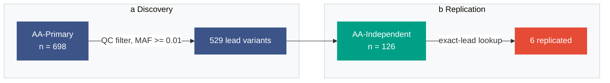

# Reference: the Mermaid structure preview

Every brief carries a `## Structure preview` section holding one Mermaid block.
It is the reader's view of the figure: a person opening the brief follows the
workflow and the logic from this block without rendering an image. It also
lets structure, wording, and colour plan be checked **before** a render is paid
for, when fixing them is free.

The image model never sees this block. It is a view of the logic, not the
deliverable, and it never substitutes for the rendered figure.

---

## A. Why it comes before the prompt

An image render costs a round trip, and its failures are hard to attribute: a
cluttered result may come from a bad prompt, a bad structure, or model noise.
The Mermaid preview separates those. If the workflow is not clear from the
preview, no amount of prompt wording will rescue the render. This is the
cheapest check that can fail, so it runs first.

It also catches the two errors that are most expensive later:

- A label that reads badly, or is misspelled, is visible here in plain text.
- A palette collision is visible as two adjacent nodes with the same fill.

---

## B. Template

Copy this and fill it in. It renders as written. Entities are nodes; processes
are labelled edges, exactly as they are arrows with a label beside them on the
canvas.

````markdown
## Structure preview

The workflow and logic of the figure, readable without rendering. Not the
figure: the rendered image follows the style contract, this does not.


````

The `init` directive is not decoration. Without it Mermaid's default theme
fills every cluster pale yellow and every edge label pale pink, which fights
the bound palette and makes a collision impossible to see. `stroke:none`
mirrors the no-outline rule of the style; a node with a visible border in the
preview is a box on the canvas.

---

## C. Binding rules

1. **One `subgraph` per panel**, its id the panel letter and its title the
   panel letter followed by the panel heading, exactly as in the prompt.
2. **One node per entity or glyph** from `## Canvas inventory`. The node count
   and the inventory's entity count agree, or one of the two is wrong. A
   preview that is visibly over-full is the word budget failing in a form you
   can see.
3. **One labelled edge per process arrow.** The edge label is the exact quoted
   process label from the inventory (`-->|"Quantile normalisation"| B`). A
   process is never a node, because on the canvas it is never a box.
4. **Node labels are the exact quoted strings** that appear in the prompt.
   A node with a name and a number uses `<br/>` between them. Do not paraphrase
   here and quote there.
5. **`classDef` fills are the hexes from `## Palette`**, one `classDef` per
   hue, named after what the hue means, all with `stroke:none`. This makes the
   preview a rendering of the palette table, so a collision shows up as two
   adjacent nodes with the same fill.
6. **Glyph type is not drawn.** The inventory says which glyph a node renders
   as; the preview shows only its label. Do not try to draw a lollipop or a
   chromosome in Mermaid.
7. **ASCII only**, exactly as in the prompt. No Greek, no LaTeX, no math
   glyphs. `>=` and `<=` are fine inside quoted labels.
8. **Flow direction matches the layout sentence.** A pipeline that runs left to
   right is `flowchart LR` with `direction LR` inside each subgraph; panels
   stacked vertically use `direction TB`.

---

## D. What it does not do

The preview shows structure, wording, grouping, flow, and colour assignment. It
deliberately shows none of the things that make the final figure look like a
journal figure: glyphs, proportion, tint fields, typographic scale, whitespace.
Do not tune those here and do not judge the figure's appearance from it.

Consequently:

- Never paste Mermaid source into an image prompt.
- Never commit the rendered Mermaid PNG or SVG as the figure.
- Never let a reviewer read the preview instead of the render.

---

## E. Diagram type by archetype

Mermaid does not need to match the archetype's visual form, only its structure.

| Archetype           | Mermaid form                                                                                               |
| ------------------- | ---------------------------------------------------------------------------------------------------------- |
| Pipeline flowchart  | `flowchart LR`, one subgraph per panel, entities as nodes, each processing step as a labelled edge         |
| Study design        | `flowchart LR`, one subgraph per cohort or arm, edges to the outcome column                                |
| Method schematic    | `flowchart TB`, one subgraph per calculation stage; the formula as a single node with the exact ASCII text |
| Result schematic    | `flowchart LR`, one subgraph per result panel, nodes naming what each panel plots rather than drawing it   |
| Conceptual overview | `flowchart LR`, three to five nodes, no subgraphs                                                          |

A result panel that is a scatter or a histogram becomes one node saying what it
plots, for example `"panel c: observed vs expected, 529 points"`. Do not try to
draw a plot in Mermaid.

---

## F. Viewing it

- **GitHub** renders Mermaid in `.md` files natively; the preview is visible in
  the file view and in a pull request with no setup.
- **VS Code** needs an extension for the built-in Markdown preview; the common
  one is `bierner.markdown-mermaid`. Without it the block shows as fenced text,
  which is still readable but not rendered.
- **Command line**, when a raster is genuinely needed for a message thread:

  ```bash
  npx -y @mermaid-js/mermaid-cli@11 -i preview.mmd -o preview.png -w 1400 -b white
  ```

  On a headless or containerized host, add a puppeteer config so Chromium
  starts:

  ```bash
  printf '{"args":["--no-sandbox","--disable-setuid-sandbox","--disable-dev-shm-usage"]}' > pc.json
  npx -y @mermaid-js/mermaid-cli@11 -p pc.json -i preview.mmd -o preview.png -w 1400 -b white
  ```

  Write that raster to the repository's `tmp/` root (`tmpdir` in the env file),
  not into the repository tree. The repository stores the brief and the
  accepted figure render, not the preview.
