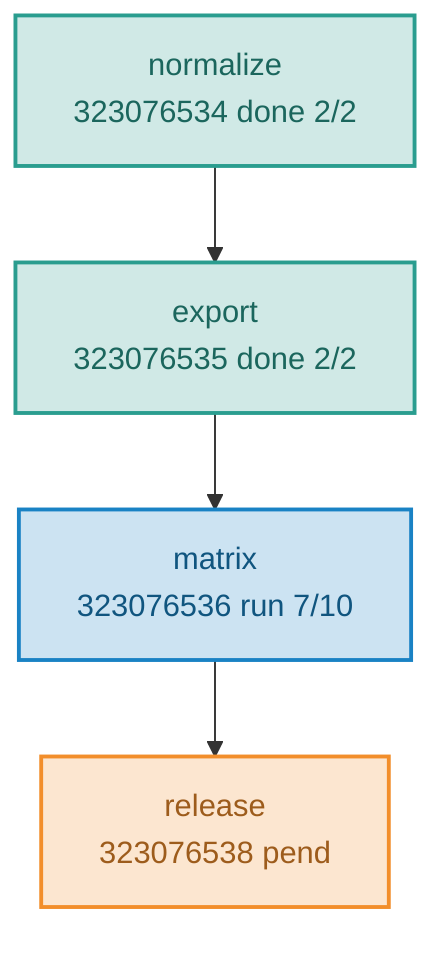

# Markdown documents

A Markdown file in this repository is read under time pressure, usually by
somebody who did not write it -- a colleague picking up a stalled run, or an
agent session with no memory of yesterday. It is optimized for **fast
comprehension, operational usefulness, and resumption**, in that order. Anything
that makes the reader reconstruct state from narrative is a defect.

This skill owns **how a document is represented**: which of Mermaid, table, task
list, code block, or prose carries each piece of information, and what shape an
operational document takes. It does not own the required sections of any
specific document type; section 10 says who does.

This skill is portable and names no project value. Paths, track names, output
roots, and legacy file names come from the repository's `.github/instructions/`
bindings or its `AGENTS.md`. Those win where they conflict.

Related skills: `analysis-pipeline` (the exact `PLAN.md` / `PROGRESS.md` /
`DECISION.md` contract), `brainstorm` (the thinking-document structure and its
Mermaid library), `image-prompt` (when a diagram graduates into a real figure),
`long-running-jobs` (the operational DAG the progress graph doubles as).

---

## 1. Choose the representation before writing

**Do not default to prose.** Prose is one of five choices, and it is the right
one only for the things the other four cannot carry. Decide per section, from
the structure of the information rather than from habit.

| The information is                                                                                                                                                                                                                                          | Use           |
| ----------------------------------------------------------------------------------------------------------------------------------------------------------------------------------------------------------------------------------------------------------- | ------------- |
| Relational or directional: workflows, pipelines, job dependencies, DAGs, execution order, architecture, data flow, state machines, sequence interactions, branching or parallel work                                                                        | Mermaid       |
| Repeated attributes a reader will scan or compare: job status, inputs and outputs, parameters, dimensions and counts, expected vs observed, dependencies and their reasons, validation results, runtimes, config differences, one row per debugging attempt | Table         |
| Actionable progress: what is done and what is not                                                                                                                                                                                                           | Task list     |
| Meant to be copied or executed: commands, code, configuration, logs, queries, file excerpts                                                                                                                                                                 | Code block    |
| Sequential or categorical, with nothing to compare across items                                                                                                                                                                                             | Simple list   |
| Interpretation, rationale, caveats, conclusions, operational warnings                                                                                                                                                                                       | Concise prose |

The test for a table is **repetition**: the moment the same three or four
attributes are stated for a third item, the paragraphs are a table that has not
been written yet. The test for a diagram is **tracing**: if the reader has to
hold "A feeds B, which also needs C" in their head, draw it.

---

## 2. Mermaid

Reach for a diagram when it communicates dependency or flow better than a
sentence can -- not to decorate a page.

Rules that hold for every block:

1. **Top to bottom.** `flowchart TD` is the default; see below.
2. **One sentence above the block** saying what to take away. A diagram with no
   claim is decoration.
3. **Under about fifteen nodes.** Past that, split into two diagrams by the
   question each answers. A reader tracing many crossing edges is worse off than
   with a list.
4. **Labels are ASCII** and carry useful state directly when it is known:
   stage name, job id, array range, state, runtime, output dimensions. Separate
   the lines with `<br/>`.
5. **A number on a node was read from a file**, never from memory. Section 5.
6. **Prose below does not repeat the diagram.** It says what the diagram cannot:
   why an edge is dotted, what a branch costs.
7. **Color is meaningful and comes from the fixed palette.** Never invent a hex
   for a diagram.

### Direction

**Default to `flowchart TD`.** A Markdown file renders in a narrow column and
the renderer scales the diagram down to fit it, so a wide `LR` graph shrinks
until nobody can read the labels, while a `TD` graph grows downward and the
reader scrolls. Vertical space is free; horizontal space is not.

`LR` is for a short linear chain -- four or five nodes with short labels -- or
for a join map where left-to-right reading order is the point. Anything else is
`TD`. When a `TD` graph is still too wide, break long labels with `<br/>`,
chain instead of fanning out, put side-by-side siblings in a
`subgraph ... direction LR`, or split the diagram in two. Do not reach for
renderer config to rescue a shape that is wrong.

One documented exception: the `## Structure preview` block in a `DIAGRAM.md`
stands in for a printed landscape figure, so it follows its archetype's
direction and its own theme block rather than these rules. -> `image-prompt`

### Color

Color is worth having and it must **mean** something: a fill is a state or a
role, never decoration. It comes from one fixed documentation palette --
`done` / `run` / `pend` / `todo` / `fail` / `dead` for a submitted pipeline,
`input` / `step` / `output` / `fork` / `blocked` / `ext` for a structural
diagram. Copy the `classDef` block verbatim, use one set per diagram, and
declare only the classes the diagram uses.

That palette is **documentation chrome, not a figure palette**: it is identical
in every repository, it encodes no cohort, trait, ancestry, or outcome, and so
it is never re-derived and never added to a track color file. Any other hex in
a diagram is a defect. -> `palette`



A fill never carries information the label does not also carry: a reader on a
grey-scale screen or looking at the raw text must lose nothing.

### Where the templates live

| Need                                                        | Library                                                                                                      |
| ----------------------------------------------------------- | ------------------------------------------------------------------------------------------------------------ |
| Direction, the full palette, and one template per question  | [references/mermaid-patterns.md](./references/mermaid-patterns.md)                                           |
| Submitted pipeline, its live state, and the classes it uses | `analysis-pipeline` [plan-and-progress.md](../analysis-pipeline/references/plan-and-progress.md) section D.1 |

---

## 3. Tables

Use tables aggressively where they cut reading time, and never merely to
decorate. A good column answers a concrete question the reader actually has:

- What is it?
- What state is it in?
- What does it depend on, and why does that dependency exist?
- What was measured, and what was expected?
- What action does this row require?

```markdown
| Step    | Job ID    | State | Depends on             | Reason                     |
| ------- | --------- | ----- | ---------------------- | -------------------------- |
| matrix  | 323076536 | RUN   | `numdone(323076535,*)` | reads the exported GDS     |
| release | 323076538 | PEND  | `numdone(323076536,*)` | packages every matrix stem |
```

- **Keep cells short.** A cell carrying two clauses is interpretation; move it
  to a sentence below the table.
- **One grain per table.** Mixing per-job rows with per-file rows forces the
  reader to re-read the header for every row.
- **A table of one row is a sentence.** A table of two columns where the second
  is always the same is a list.
- Put the long interpretation below the table, not inside it.

---

## 4. Task lists

Actionable progress is a checklist, never a paragraph. Each item carries the
evidence that closed it, so that "done" is checkable.

```markdown
- [x] 01-export -- done 2026-09-16, 2 of 2 tasks exit 0, 7,680 columns out
- [ ] 02-matrix -- submitted, job 323076536 [1-10]
- [ ] 03-release -- waiting on 02
```

An unchecked box with no note is indistinguishable from work nobody has looked
at. Say whether it is queued, blocked, or not started.

---

## 5. Measured state over narrative history

An operational document's job is to say what is true **now**. History stays only
where it explains the present.

- **Distinguish measured from projected, every time.** A measured number names
  where it was read from; a projected one says so in the same cell and says what
  will replace it.
- **Never silently replace a measured value with an earlier estimate**, and
  never carry a number forward from a chat message or an older draft without
  re-reading the source.
- Keep these pairs visibly apart: completed vs running vs queued; expected vs
  observed; current failure vs historical failure; required dependency vs
  incidental execution order.
- Prefer rewriting a section to appending a correction below a stale one. The
  exception is a rejected option or a superseded decision, which is appended to
  and never overwritten -- that is what the decision log needs later.

---

## 6. Structure an operational document for resumption

This applies to progress, implementation, migration, release, debugging, and
execution documents -- anything a second person or session has to pick up. The
reader must reach the current state without reading the history.

Near the top, the document answers, in this order:

1. What is already complete?
2. What is running now?
3. What is waiting, and on what?
4. Is anything still required from the operator?
5. What happens next?
6. How is the state checked?
7. What should be done if something fails?

The spine that answers them:

| Element                                                  | Include when                                           |
| -------------------------------------------------------- | ------------------------------------------------------ |
| Title and current scope                                  | always                                                 |
| Links to the plan, decision record, issue, or spec       | always                                                 |
| Short resume / current-state summary                     | always, near the top                                   |
| Mermaid graph of the active workflow or dependencies     | relationships matter, or any step has been submitted   |
| Compact table of jobs, stages, artifacts, or status      | more than two of anything                              |
| Task list of completed and remaining work                | always                                                 |
| Verified measured results, marked as measured            | any number was produced by a run                       |
| Commands to inspect, verify, resume, or operate the work | always                                                 |
| Caveats, failure behavior, operational warnings          | an operator could do the wrong thing without them      |
| Error history                                            | it explains the current state or prevents re-debugging |
| Key paths and artifacts needed to continue               | always                                                 |

Sections stay in a fixed order so a reader can scan for one; organize by section
and never by chronology.

---

## 7. Emphasis

Bold is for facts the reader must not miss, and it stops working the moment it
is used for emphasis in general. Reserve it for:

- what is currently running, and what is blocked;
- what must not be re-run, and what has already been submitted;
- destructive or irreversible actions;
- a surprising measured result;
- failure behavior that changes what the operator should do.

Two or three bold spans per screen is the working budget. A paragraph with four
is a paragraph with none.

---

## 8. Keep failure history, compactly

Do not delete a failure that explains an environmental quirk, a workaround, or
why a design is the way it is -- it gets paid for twice otherwise. But summarize
it; a document is not a log file.

When an investigation ran several experiments, the experiments are a table and
the conclusion is prose:

```markdown
| Attempt | Change                       | Result                            |
| ------- | ---------------------------- | --------------------------------- |
| 1       | baseline                     | exit 2 in 12 s, no program output |
| 2       | forced the job shell to bash | same failure                      |
| 3       | stripped the completion loop | exit 0, program ran               |
```

Then one short paragraph: what the cause turned out to be, what the fix was, and
what it means for the next run.

**Never dump raw logs** unless the raw text itself is the evidence. When it is,
quote the few lines that matter inside a code block, not the file.

---

## 9. Avoid mechanical formatting

The objective is not to maximize visual elements. A document where every section
is a table is as hard to read as one that is all prose.

Before writing a substantial section, ask in order:

1. Would the relationships be clearer as Mermaid?
2. Are repeated attributes better as a table?
3. Is this actionable progress, and therefore a checklist?
4. Is this meant to be copied or executed, and therefore a code block?
5. Is prose still the clearest representation?

Take the simplest representation that preserves the important information.

Forbidden patterns:

- A wall of prose carrying repeated attributes that a table would show at a
  glance.
- A table with one row, or with a column that never varies.
- A diagram so large the reader traces crossing edges.
- An `LR` flowchart wide enough that the renderer scales its labels down to
  unreadable.
- A hex in a diagram that is not one of the documentation palette classes.
- A fill that carries a meaning the node label does not also carry.
- A diagram or table with no sentence saying what to take away.
- Bold used for general emphasis rather than for a must-not-miss fact.
- A progress document whose current state can only be found by reading its
  history in order.
- A number with no indication of whether it was measured or projected.
- A raw log pasted in full where three lines were the evidence.
- Emoji, anywhere.

---

## 10. Who owns which document

This skill governs representation. The required sections, naming, and tier rules
for each document type belong to the skill or rule that owns it -- follow that
one for structure, and this one for how each part is rendered.

| Document                                                            | Owner                                                                  |
| ------------------------------------------------------------------- | ---------------------------------------------------------------------- |
| `PLAN.md`, `PROGRESS.md`, `DECISION.md` and their dated tier-2 sets | `analysis-pipeline`, section 1.1 and `references/plan-and-progress.md` |
| `BRAINSTORM.md`                                                     | `brainstorm`, section 3                                                |
| `DIAGRAM.md`                                                        | `image-prompt`                                                         |
| `AGENTS.md`                                                         | `copilot-instructions.md`, "Track Guide"                               |
| `DATA.md`                                                           | `data-catalog`                                                         |
| Paired `config.sh.md` / `config.R.md` / `NN-step.md`                | `analysis-pipeline`, section 3                                         |

Where an owner prescribes a section, that section still obeys the rules above:
its job table is a table, its pipeline graph is Mermaid, its verify block is a
code block.

---

## References

- [references/mermaid-patterns.md](./references/mermaid-patterns.md) -- the
  direction rule, the documentation palette, and one copyable template per
  question a diagram can answer.
