# Reference: Mermaid patterns

One template per question a reader might have. Copy the one that matches the question, not the one that looks impressive.

These diagrams are for **reading in the editor and on the repository host**. They are not figures. A diagram that needs glyphs, a caption, or a real scientific palette has outgrown a Markdown file and belongs in a `DIAGRAM.md` -> `image-prompt`.

---

## A. Rules for every block

1. **Top-to-bottom by default.** Section B.
2. **Color comes from the documentation palette in section C, and nowhere else.** Never invent a hex for a diagram.
3. **Under about fifteen nodes.** Past that, split by question. The one exception is the end-to-end overview of a reference document (`SKILL.md` section 11), when it is grouped into subgraphs.
4. **ASCII only** in every label. `>=`, `<=`, `+/-`, `->`. No Greek, no LaTeX, no emoji.
5. **A number on a node was read from a file.** Same rule as the prose.
6. **One sentence above the block** saying what to take away. A diagram with no claim is decoration.
7. **Edge style is the vocabulary:**

   | Edge             | Means                                            |
   | ---------------- | ------------------------------------------------ |
   | `-->`            | required dependency                              |
   | `-.->`           | optional, sensitivity, or cross-check path       |
   | `-.blocks.->`    | blocked; the label names the blocker             |
   | `-->\|"label"\|` | a process, with the process named on the edge    |
   | `==>`            | the critical path, at most one chain per diagram |

8. **In a data-flow diagram, a process is an edge, not a node.** "Quantile normalization" is a labelled arrow; "normalized matrix" is a box. In a pipeline or dependency diagram, where the reader asks what runs after what, a stage is a node and takes `step`.
9. **Prose does not repeat the diagram.** It says why an edge is dotted and what the cost of a branch is.

---

## B. Direction: `TD` unless the graph is tiny

**Default to `flowchart TD`.** Markdown renders in a narrow column and the renderer scales a diagram down to fit that width. A wide `LR` graph is therefore shrunk until its labels are unreadable, while a `TD` graph grows downward and the reader scrolls. Vertical space is free; horizontal space is not.

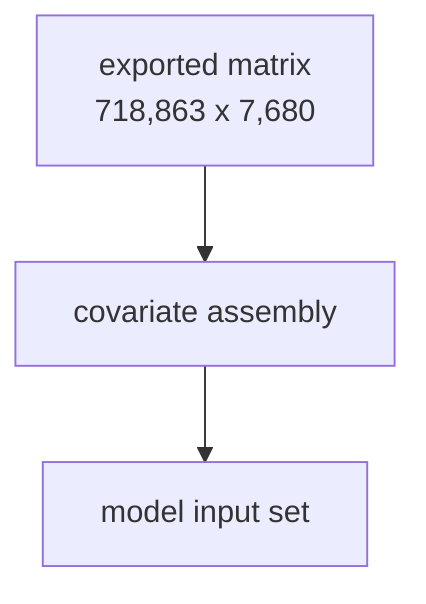

`LR` is allowed in exactly two cases:

- a linear chain of at most four or five nodes with short labels;
- a join map where the left-to-right reading order is the point, and the labels are short enough that the whole graph still fits the column.

Keeping a `TD` graph narrow:

| Problem | Fix |
| --- | --- |
| One node is very wide | Break the label with ` ` into two or three short lines |
| A fan-out widens the whole row | Chain `A --> B --> C` instead of `A --> B & C` where order allows |
| Siblings belong side by side | `subgraph ... direction LR ... end` inside the `TD` graph |
| Still too wide | Split into two diagrams, one per question |

The `direction` statement inside a subgraph has a documented limitation: **if any node in the subgraph is linked from outside it, the subgraph's own direction is ignored** and it inherits the parent graph's direction. Link to the subgraph itself, not to a node inside it, when the inner direction matters.

`sequenceDiagram`, `gantt`, `quadrantChart`, and `mindmap` have no direction statement; this section applies to `flowchart`, `graph`, and `stateDiagram`.

Mermaid also exposes `nodeSpacing`, `rankSpacing`, and `wrappingWidth` through a diagram's front-matter `config:` block. Support varies by renderer, so **never rely on them to make a diagram legible** -- fix the shape instead.

---

## C. The documentation palette

Color carries meaning here, so it is worth having, but it is **fixed chrome**: copy the `classDef` block verbatim, never re-derive it, never extend it, and never add it to a track `color.R`. It encodes document state and structural role, not a cohort, trait, ancestry, or outcome, so the one-color-file rule does not reach it -> `palette`.

Two sets. **Never mix them in one diagram** -- a diagram is either about run state or about structure.

### C.1 State classes, for an operational DAG

Six classes, no more: `done`, `run`, `pend`, `todo`, `fail`, `dead`. The block, the class table, and the rules for classing a submitted pipeline are owned by `analysis-pipeline` [plan-and-progress.md](../../analysis-pipeline/references/plan-and-progress.md) section D.1. Copy it from there so the two never drift.

### C.2 Role classes, for a structural diagram

For a landscape, a dependency map, a join map, or a capability map, where the question is what a box **is**, not what state it is in.

| Class     | Role                                           |
| --------- | ---------------------------------------------- |
| `input`   | data that already exists on disk               |
| `step`    | a script, stage, or process that runs          |
| `output`  | an artifact this work delivers                 |
| `fork`    | a decision, question, or branch point          |
| `blocked` | missing, blocked, or known wrong               |
| `ext`     | external, out of scope, or somebody else's job |

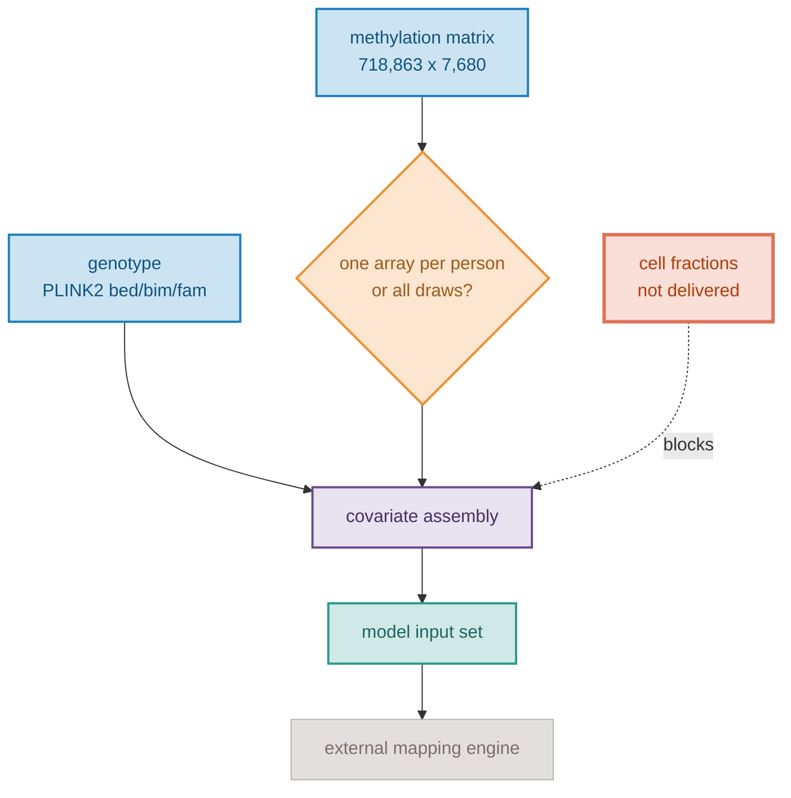

Declare only the classes the diagram actually uses. A `classDef` with no node is noise in the source.

Two things the palette is not allowed to do:

- **Carry a meaning the label does not also carry.** A reader on a grey-scale screen, with a color-vision deficiency, or looking at the raw text must lose nothing. The `blocked` node above says "not delivered" in its label too.
- **Grow.** A seventh role nobody treats differently is noise. Reach for grouping, edge style, or a second diagram instead.

### C.3 The role classes in a reference document

A diagram in a reference document describes a finished product, so the six role classes read as follows. Use them the same way in every diagram of the document, so a color means one thing throughout.

| Class | In a data release |
| --- | --- |
| `input` | what entered the process: raw files, source lists, upstream tables |
| `step` | an intermediate set that does not ship as such; in the end-to-end overview, a pipeline stage |
| `fork` | a split of the kept items into several groups, or a manual sign-off. A gate that only removes items is not a fork: its removed set is a `blocked` node named after the gate |
| `blocked` | items or features removed, or known wrong: excluded, masked, failed, corrupt |
| `output` | a shipped product, or the shipped set of items |
| `ext` | not shipped: outside the bundle, report-only, retired, or absorbed into another row |

Node labels carry counts and shapes, never job ids, states, or runtimes; those belong to operational documents.

---

## D. Pattern library

| Question the reader has | Pattern |
| --- | --- |
| What is the shape of this whole thing? | D.1 `flowchart TD`, one subgraph per status band |
| What blocks what, and what is the long pole? | D.2 `flowchart TD` of dependencies only, critical path as `==>` |
| Which way at this fork? | D.3 `flowchart TD` decision tree, one branch per option |
| How do these files actually join? | D.4 `flowchart TD` with format and join key on each edge |
| What can this unfamiliar tool do? | D.5 `flowchart TD` of modes, each with what it consumes and emits |
| Who has to do what, and in what order? | D.6 `sequenceDiagram` across people and systems |
| When can each piece start? | D.7 `gantt`, only when the blockers have real dates |
| What is worth doing first? | D.8 `quadrantChart`, effort against value |
| What are all the things we might do? | D.9 `mindmap`, divergent phase only |
| Where were items removed, and where did the rest go? | D.10 `flowchart TD` funnel, removals branching off the set they left |
| Which rows were merged into one? | D.11 `flowchart TD` aggregation, absorbed members dotted |
| What was submitted, and what state is it in? | `analysis-pipeline` plan-and-progress.md section D.1 |

### D.1 The whole picture

For: _what is the shape of this entire problem?_ One subgraph per status band. This is the one diagram every landscape document has.

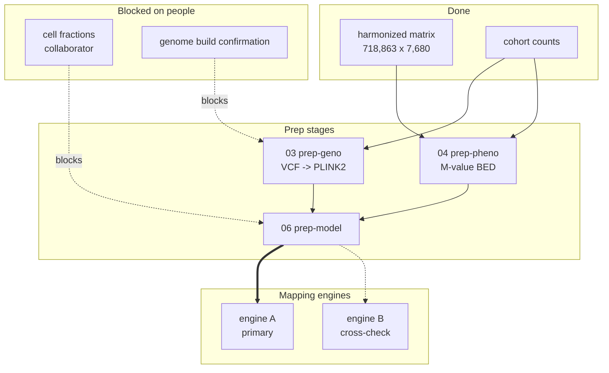

Band names that work: `Done`, `Blocked on people`, `To build`, `Later`. Keep them to four. A fifth band means two diagrams.

### D.2 Dependency and critical path

For: _what blocks what, and where is the long pole?_ Strip everything that is not a dependency. Mark the single longest chain with `==>`.

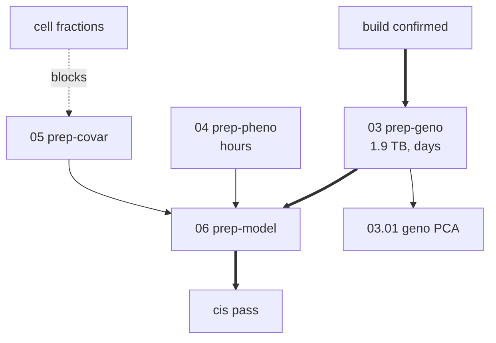

Say in one sentence underneath how long the `==>` chain is and what would shorten it. That sentence is usually the most actionable line in the document.

### D.3 One fork, as a decision tree

For: _which way at Q3?_ One branch per option in the question block, leaf = the consequence. Use the same option letters as the table.

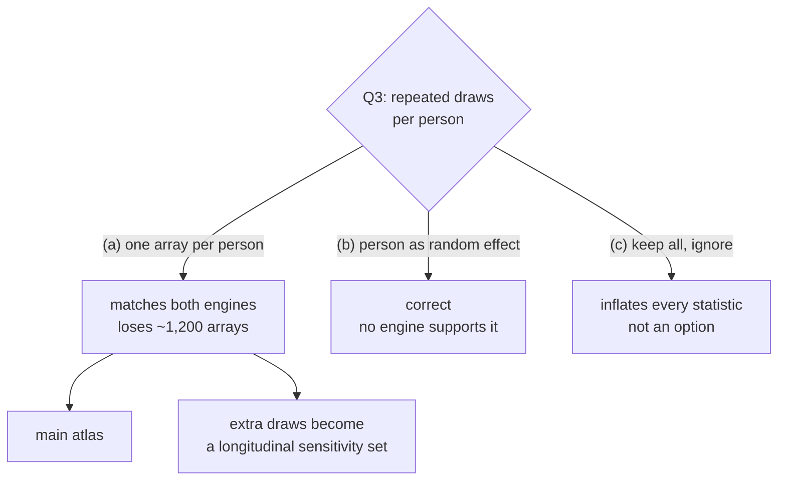

Only draw this for a fork whose options have different downstream shapes. A fork between two parameter values is a table, not a diagram.

### D.4 File and join flow

For: _how do these files actually join?_ Format on the node, join key and direction on the edge. This is the diagram that catches a key-format mismatch before any code is written.

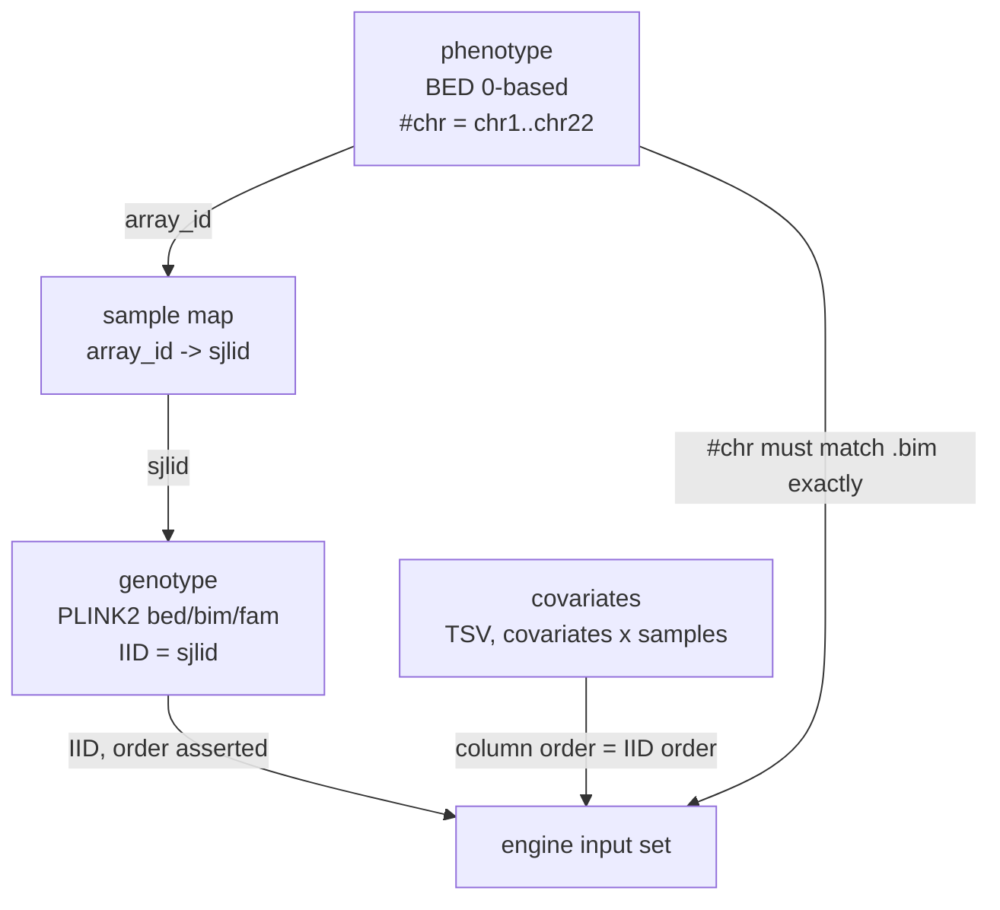

Put the orientation (`rows x columns`), the coordinate base (0- or 1-based), and the chromosome naming on the node label. All three are silent failure modes.

### D.5 An unfamiliar tool's capability map

For: _what can this thing actually do?_ Built from the installed binary's `--help`, not the upstream docs. The `unsupported` subgraph is the point of the diagram.

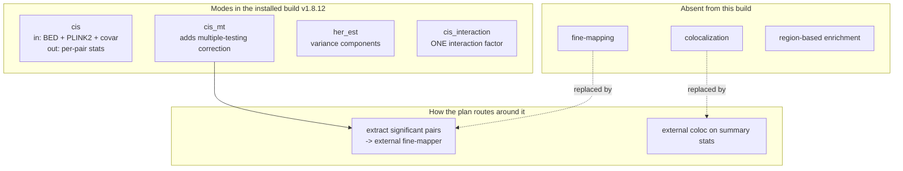

### D.6 Who does what

For: _this is blocked on people, in what order?_ Use when two or more humans and a handoff are involved. Clearer than a flowchart for anything with a back-and-forth.

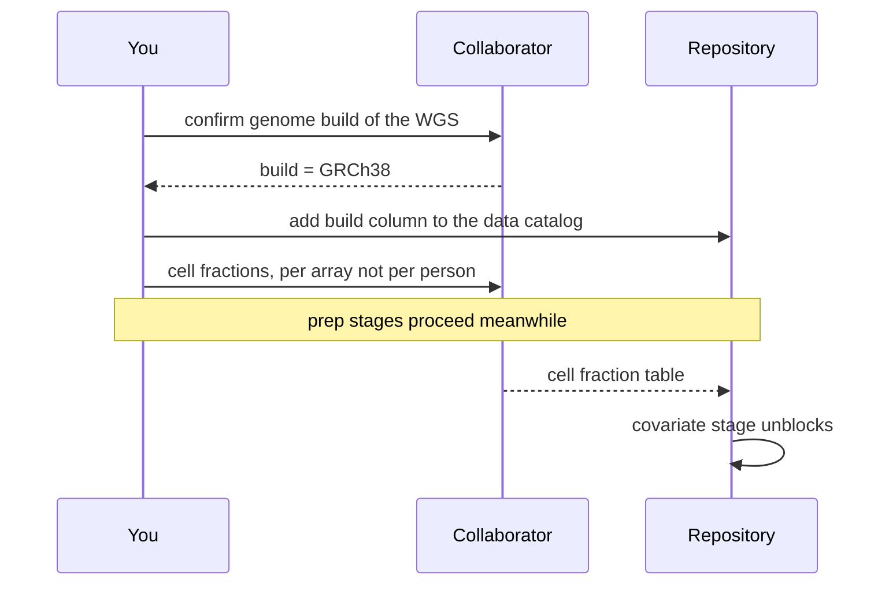

### D.7 Sequencing with real dates

For: _when can each piece start?_ Only draw a `gantt` when the blockers have actual dates. Invented dates in a gantt read as commitments.

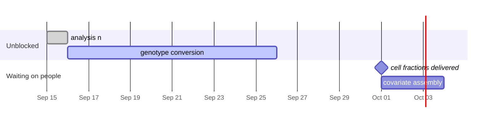

### D.8 Triage

For: _what is worth doing first?_ Effort against value, when several independent pieces compete for the same week.

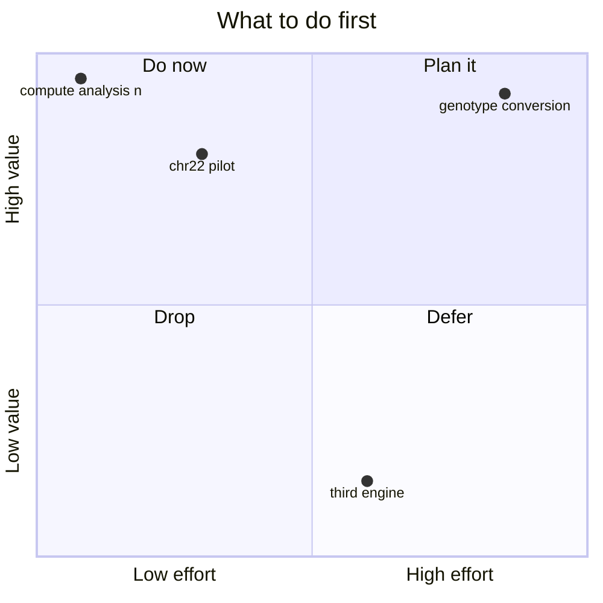

### D.9 Divergent phase only

For: _what are all the things we might do?_ A `mindmap` is useful in the first round of a discussion and misleading afterwards, because it shows no dependency and no cost. Replace it with D.1 once the picture converges; do not keep both.

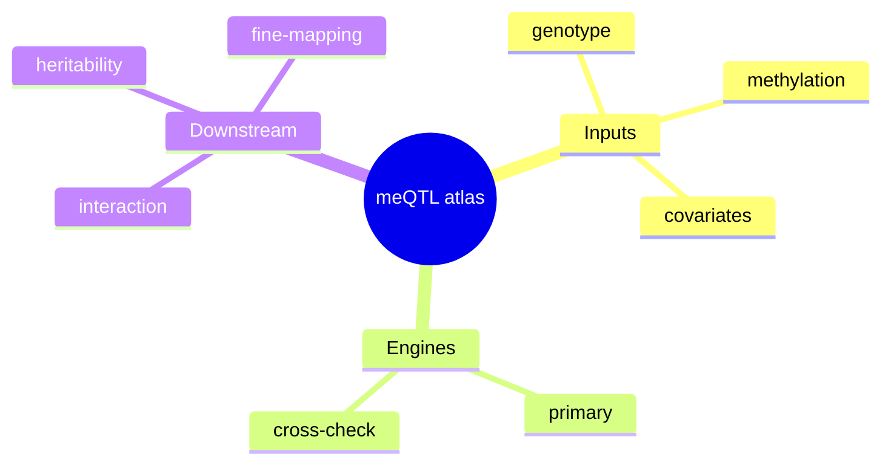

### D.10 A funnel

For: _where were items removed, and where did the rest go?_ Every node carries its count, each removal branches off the set it was removed from, and the children of a node add up to it. The same counts sit in a funnel table beside the diagram; the table is authoritative and carries the exact reason strings.

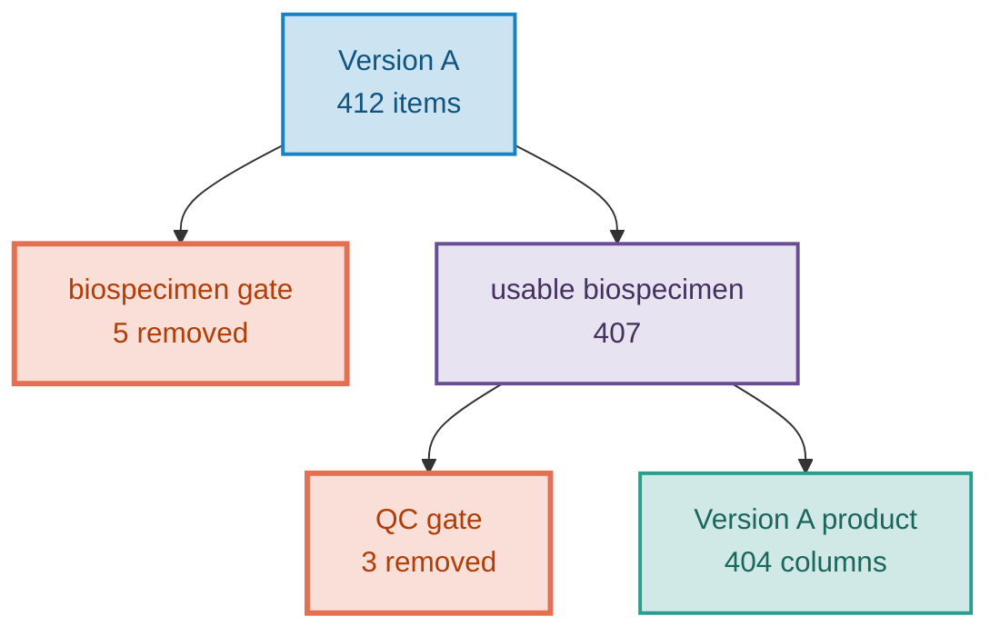

Draw one funnel per version or unit. Two funnels may share a diagram as two subgraphs while the pair stays under the fifteen-node limit; otherwise each gets its own. Merge criteria that act at the same point into one removal node, and let the funnel table carry the split. A split into several products is the same shape, with a `fork` where the kept items split and one `output` leaf per product.

### D.11 Aggregation

For: _which rows were merged into one, and where did the absorbed ones go?_ Use it when a product carries fewer rows than its source because duplicates were collapsed into one summary row.

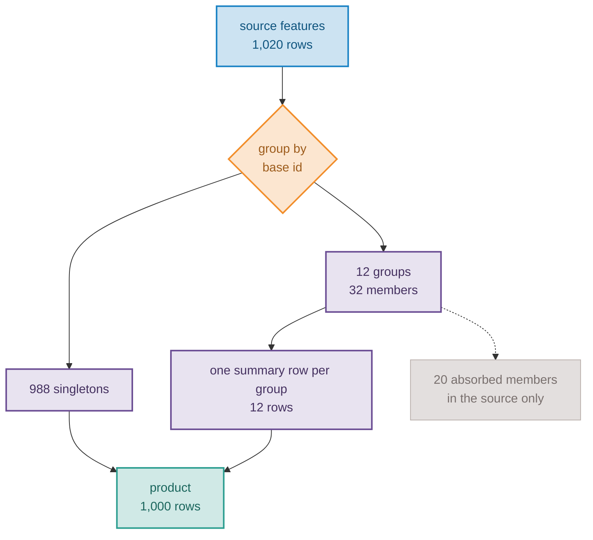

Say below it how the summary row is computed and named, which columns list the members, and how to find the summary row of an absorbed member.

---

## E. Viewing

- **GitHub** renders Mermaid in `.md` natively, in the file view and in a pull request, with no setup.
- **VS Code** needs an extension for the built-in Markdown preview; the common one is `bierner.markdown-mermaid`. Without it the block shows as fenced text, which is still readable.
- A syntax error renders as an error box, so preview the file once before handing it over. The usual causes are an unquoted label containing `(`, `:`, or `,`; a ` ` written as ` `; a lowercase `end` inside a node label; and a `subgraph` id that collides with a node id.
- Do not render a documentation diagram to PNG or SVG, and never commit one. The block in the file is the deliverable.
