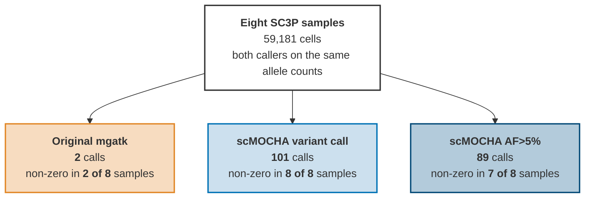
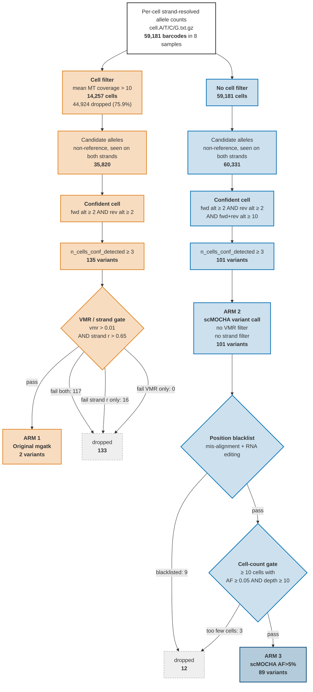
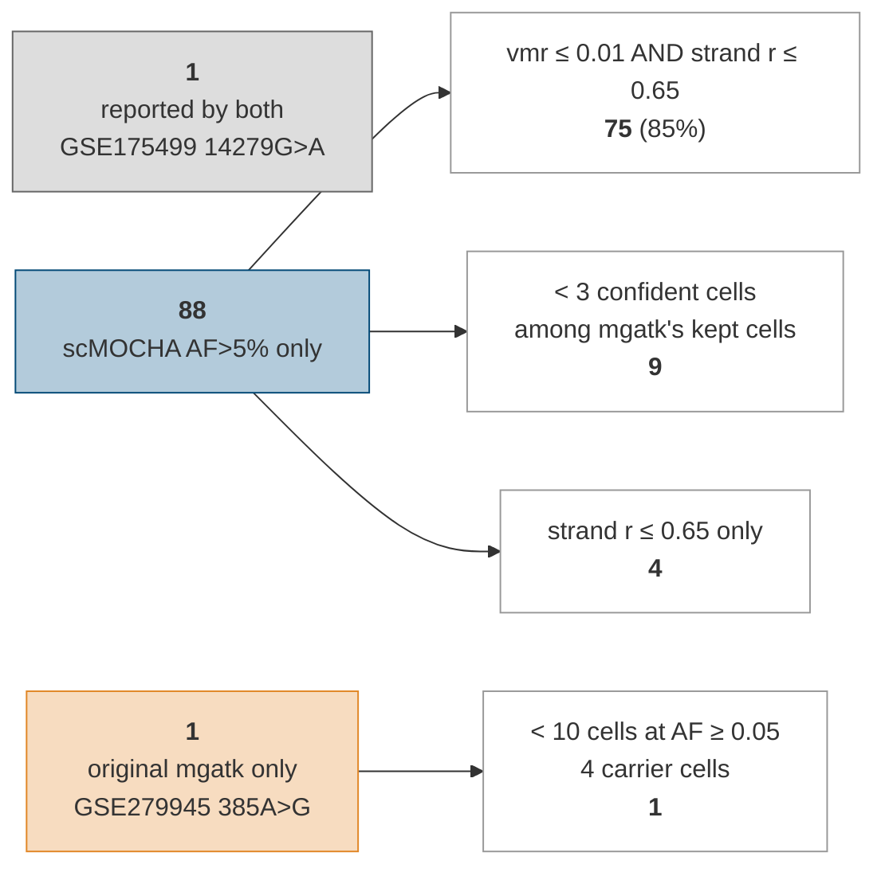

# DIAGRAM: the three calling arms pooled over the eight 3' samples

Companion to `DIAGRAM.md`. That file draws one sample,
`GSE181279_GSM5494116_5PPE`, the only library deep enough for original mgatk to
return a usable set. This file draws the **eight 3' samples** that the
cross-sample panels use - `CROSS_SAMPLE_FIG_IDS` in `config.R`, i.e. every
sample except the two 5' libraries `GSE181279_GSM5494116_5PPE` (SC5P-PE) and
`GSE163668_GSM4995445_5PR2` (SC5P-R2).

Every number was read on 2026-09-22 from `newplots/compare-with-mgatk/tables/`
(written by the 2026-09-17 and 2026-09-20 runs). Regenerate the stage before
quoting them.

**A pooled count is a count of sample-variant pairs, not of distinct
variants.** The 89 retained calls are 65 distinct variants; `15326A>G` appears
in six of the eight samples and `11719G>A` in five. Pooling is the right grain
here because each sample is an independent run of both callers, but it is not a
catalogue of distinct mtDNA positions.

---

## 1. What each arm yields across the eight 3' samples

This is the claim the eight 3' samples make on their own: in 3' data the mgatk
gate does not shift the output, it empties it. `figures/cross-sample/07a-arm-yield`
is the plotted version of the table below.

| Sample | Chemistry | Cells | Original mgatk | scMOCHA call | scMOCHA AF>5% |
| --- | --- | ---: | ---: | ---: | ---: |
| GSE149689_GSM4509019 | SC3Pv3 | 721 | **0** | 20 | 20 |
| GSE155673_GSM4712895 | SC3Pv3 | 5,805 | **0** | 6 | 6 |
| GSE163314_GSM4976997 | SC3Pv2 | 7,949 | **0** | 9 | 9 |
| GSE175499_GSM5335510 | SC3Pv3 | 5,993 | 1 | 14 | 10 |
| GSE188632_GSM5687372 | SC3Pv3 | 17,919 | **0** | 24 | 22 |
| GSE220189_GSM6793474 | SC3Pv3 | 5,639 | **0** | 1 | 1 |
| GSE271107_GSM8369876 | SC3Pv3 | 8,645 | **0** | 2 | **0** |
| GSE279945_GSM8583916 | SC3Pv3 | 6,510 | 1 | 25 | 21 |
| **Pooled** | | **59,181** | **2** | **101** | **89** |

---

## 2. The three arms end to end, pooled over the eight samples

Read against the same diagram for GSE181279 in `DIAGRAM.md`, the shape is
identical and only the survival rate changes. The mgatk gate keeps 230 of 1,247
S1 variants (18.4%) in the deep 5' sample and **2 of 135 (1.5%)** across the
eight 3' samples. The scMOCHA gate keeps 216 of 736 (29.3%) there and
**89 of 101 (88.1%)** here, because in 3' data the call arm has already been
narrowed to variants with real read support.

The criteria themselves are unchanged; section 3 of `DIAGRAM.md` is the
criterion-by-criterion table and is not repeated here.

---

## 3. Why the two reported sets differ (pooled)

Comparing arm 1 (2) against arm 3 (89): **1 shared, 1 mgatk only, 88 scMOCHA
AF>5% only**.

- **90% of what mgatk misses (79 of 88) fails the strand-correlation cutoff**,
  alone or together with VMR. The remaining 9 are mgatk candidates that never
  reach its S1 stage; since mgatk's confident-cell rule is the looser of the two
  (no `fwd+rev alt >= 10`), the cell filter is the only criterion that can have
  removed them.
- **The single mgatk-only call is a low-support one.** `385A>G` in GSE279945 has
  4 carrier cells, below the 10-cell gate.
  `tables/GSE279945_GSM8583916_3PV3/05-read-support.tsv` puts its
  `Original mgatk only` set at a median of 1 alt read over 7 detections, against
  29 alt reads for `scMOCHA only` in the same sample.

---

## 4. Why the mgatk gate empties in 3' data

The gate is two cutoffs, and only one of them is doing the work.

| Of the 135 mgatk S1 variants, pooled | n | % |
| --- | ---: | ---: |
| pass `vmr > 0.01` | 18 | 13.3 |
| pass `strand r > 0.65` | 2 | 1.5 |
| pass both -> retained | 2 | 1.5 |

Per sample, the strand correlation of the mgatk S1 set against the 0.65 floor:

| Sample | mgatk S1 | median strand r | max strand r | above floor |
| --- | ---: | ---: | ---: | ---: |
| GSE149689_GSM4509019 | 19 | 0.078 | 0.569 | 0 |
| GSE155673_GSM4712895 | 19 | -0.062 | 0.196 | 0 |
| GSE163314_GSM4976997 | 4 | -0.106 | 0.006 | 0 |
| GSE175499_GSM5335510 | 20 | 0.024 | 0.673 | 1 |
| GSE188632_GSM5687372 | 32 | 0.102 | 0.503 | 0 |
| GSE220189_GSM6793474 | 6 | -0.089 | 0.013 | 0 |
| GSE271107_GSM8369876 | 6 | -0.206 | 0.048 | 0 |
| GSE279945_GSM8583916 | 29 | -0.087 | 0.919 | 1 |
| **Pooled** | **135** | **0.006** | **0.919** | **2** |

Six of the eight samples never reach the floor at all - their best variant
peaks at 0.569 - and the two that do reach it do so with exactly one variant
each. `figures/cross-sample/07c-strand-correlation` is the plotted version.

**What this does not show.** It does not explain *why* the correlation collapses
in 3' data. Spearman rho between strand correlation and per-variant coverage is
-0.013 (P = 0.66) in the only sample large enough to test it, so no mechanism is
claimed here; see `M4` in the campaign decision log.

---

## 5. What the eight samples cannot answer

- **The editor's bias question is not testable in any 3' sample.**
  `tables/cross-sample/07-gate-test.tsv` reports `testable = FALSE` for all
  eight: the gate-passing group is empty in seven and has one member in
  GSE175499, so there is nothing to compare the rejected group against. The one
  computable test is in GSE181279, which these panels exclude. Read
  `DIAGRAM.md` alongside this file.
- **The cell filter costs almost nothing here.** Pooled, mgatk drops 44,924 of
  59,181 cells (75.9%) and 35,214 of 113,256 variant detections, yet only
  **5 variants** fall below 10 carrier cells as a result, all of them in
  GSE163314. The variant loss is the gate's, not the cell filter's.
- **The retained set is prevalence-heavy.** The 89 AF>5% calls have a median of
  165 carrier cells and a median carrier AF of 1.0, so most are near-homoplasmic
  in 3' data. Any low-heteroplasmy claim belongs to the deep 5' sample.

---

## 6. Notes

- Sample selection is `CROSS_SAMPLE_FIG_IDS` in `config.R`, i.e.
  `SAMPLE_IDS` minus `CROSS_SAMPLE_FIG_EXCLUDE`.
- Per-sample yields and cell counts come from
  `tables/cross-sample/07-sample-overview.tsv` and `07-cell-filter.tsv`.
- Pooled funnel counts are the row sums of `tables/<id>/03-funnel-counts.tsv`
  and `tables/<id>/02-cell-inclusion.tsv` over the eight samples.
- Pooled arm membership, exclusion reasons, strand r and VMR come from
  `tables/<id>/03-variant-membership.tsv`, the only table carrying one row per
  variant with both callers' statistics.
- Exclusion reasons are assigned by first failed criterion in each arm's own
  order, so each excluded variant is attributed to exactly one cutoff. The
  order is set in `fn_exclusion_*` in `config.R`.
- Colours match `color_arm` in `high-res/00-colors.R`: mgatk `#E18727`,
  scMOCHA call `#0072B5`, scMOCHA AF>5% `#044A77`. The fills above are
  lightened versions for readability behind black text.
