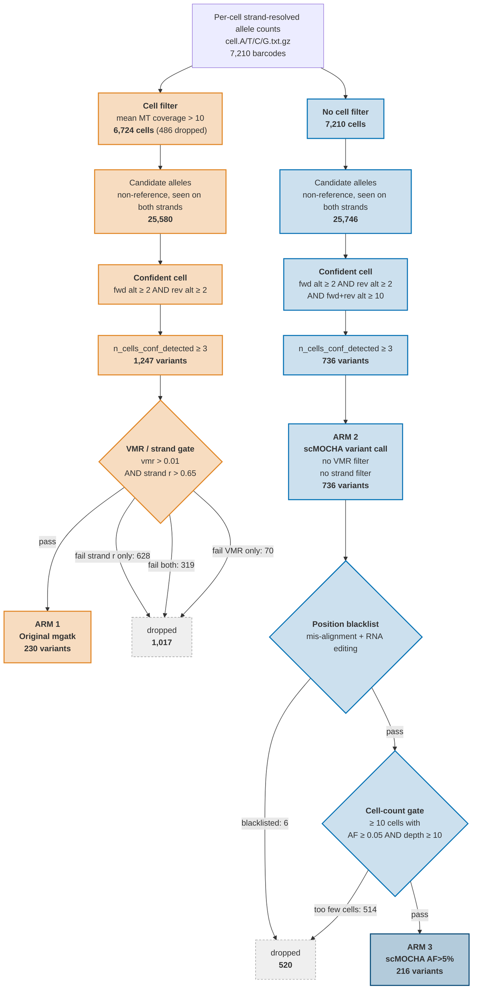
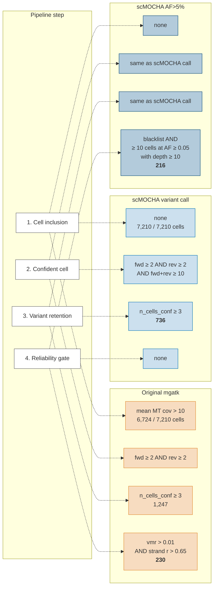
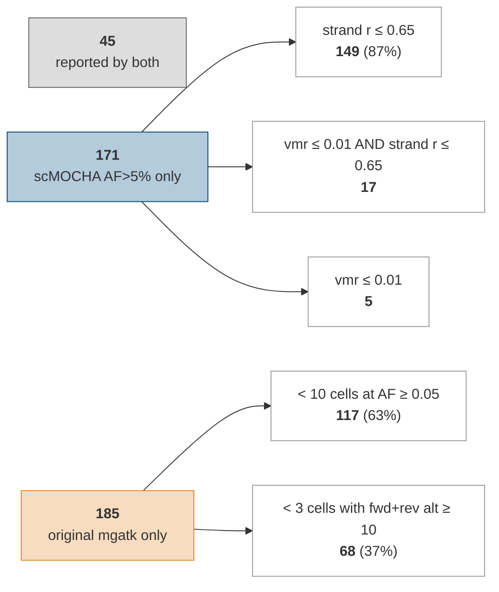

# DIAGRAM: three calling arms, their cutoffs, and their counts

Sample: 7,210 cells, `SAMPLE_LABEL` pending. Every number below is read from
`newplots/compare-with-mgatk/tables/`, generated 2026-09-09. Regenerate the
stage before quoting them.

---

## 1. The three arms end to end

Arm 3 is a strict subset of arm 2: the AF&gt;5% rule is applied downstream in
`src/06.1-collect-variants-new.R`, not during variant calling.

---

## 2. Where the criteria differ

---

## 3. Why the two reported sets differ

Comparing arm 1 (230) against arm 3 (216): 45 shared, 185 mgatk only,
171 scMOCHA AF&gt;5% only.

Read this as the summary of the whole stage:

- **87% of what mgatk misses is lost to the strand-correlation cutoff alone**,
  not to VMR and not to read depth.
- **What scMOCHA drops is dropped for prevalence or read support**: too few
  carrier cells, or too few alt reads per cell. The variants only mgatk reports
  carry a median of 9 alt reads per carrier cell, against 48 for the shared
  variants.

---

## 4. Notes

- Every count comes from `03-funnel-counts.tsv`, `03-exclusion-reasons.tsv`,
  `02-cell-inclusion.tsv` and `05-read-support.tsv`.
- Exclusion reasons are assigned by first failed criterion in each arm's own
  order, so each excluded variant is attributed to exactly one cutoff. The
  order is set in `fn_exclusion_*` in `config.R`.
- The mgatk S1 -> S2 breakdown (628 / 319 / 70) counts all 1,247 mgatk S1
  variants, not only those scMOCHA also reports.
- Colours match `color_arm` in `high-res/00-colors.R`: mgatk `#E18727`,
  scMOCHA call `#0072B5`, scMOCHA AF&gt;5% `#044A77`. The fills above are
  lightened versions for readability behind black text.
